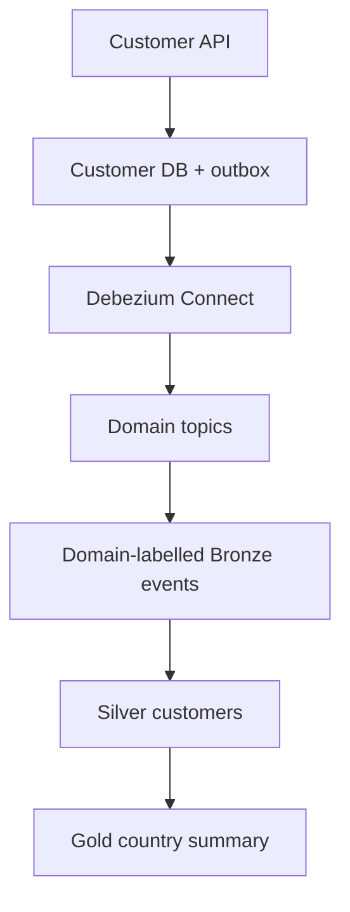

# Event-Driven Analytics Platform

A runnable educational reference for moving transactional data into an analytical model without dual writes. It demonstrates hexagonal application code, database-per-service, a transactional outbox, PostgreSQL logical decoding, Debezium, Kafka, idempotent stream processing, Medallion layers, dbt, data quality checks, observability endpoints, and Testcontainers.

## Implemented scope

| Area | Implementation |
|---|---|
| Operational APIs | Customer, invoice, invoice-adjustment, payment, and identity services, each with its own PostgreSQL database |
| Reliable events | Domain write and its outbox row are committed in one local transaction |
| CDC | One connector per source service routes events to domain topics; invoice and invoice-adjustment both publish to `outbox.event.invoice` |
| Streaming | Kafka 4 in KRaft mode; consumer group writes idempotently to analytics storage |
| Analytics | Domain-labelled immutable Bronze events, typed Silver entities, Gold customer and payment summaries |
| ELT | dbt incremental Silver model, Gold model, schema tests, and a singular quality test |
| Workload | Configurable customer data generator |
| Operations | Docker Compose, Actuator health/Prometheus metrics, provisioned Grafana dashboard, helper script, and CI |
| Testing | MVC/integration tests with a real PostgreSQL Testcontainer |

The deliberately similar outbox implementations are retained because topic-per-domain and database-per-service are concepts this repository is meant to demonstrate. A domain is not assumed to equal a service: `invoice-service` emits `InvoiceIssued`, while `invoice-adjustment-service` emits `InvoiceAdjusted`; their independent CDC connectors converge on the Invoice domain topic.

## Data flow



## Quick start

Requirements: Docker Engine with Compose v2 and `curl`. Host Java/Maven are not required.

```bash
chmod +x bin/dev
./bin/dev up
./bin/dev register-cdc
./bin/dev generate 100
curl http://localhost:8082/api/analytics/customers-by-country
```

Grafana is available at <http://localhost:3000> (`admin` / `admin`) with the Customer Analytics dashboard preloaded.

Connector startup can take several seconds. If registration initially cannot connect, wait until `curl http://localhost:8083/` succeeds and rerun it. Inspect state with:

```bash
curl http://localhost:8083/connectors/customer-outbox/status
./bin/dev health
./bin/dev logs analytics-service
```

Create one record manually:

```bash
curl -X POST http://localhost:8081/api/customers \
  -H 'Content-Type: application/json' \
  -d '{"email":"ada@example.com","fullName":"Ada Lovelace","countryCode":"GB"}'
```

To demonstrate two source services sharing the Invoice domain topic, create an invoice and then send its returned `id` to the adjustment service:

```bash
curl -X POST http://localhost:8087/api/invoice-adjustments \
  -H 'Content-Type: application/json' \
  -d '{"invoiceId":"<invoice-id>","amount":10.00,"currency":"EUR","reason":"Demo credit"}'
```

Both `InvoiceIssued` and `InvoiceAdjusted` are available from `outbox.event.invoice`; their `eventType`/`type` headers tell consumers which schema to apply.

Run tests in a Java 25 Maven container with `./bin/dev build`. Testcontainers tests automatically skip when Docker is unavailable.

## dbt rebuild path

The streaming consumer maintains low-latency projections. dbt demonstrates the independently reproducible batch path from Bronze and should be treated as the authoritative transformation definition in a larger platform.

```bash
cd analytics/dbt
cp profiles.yml.example profiles.yml
dbt build --profiles-dir .
```

See [architecture and guarantees](docs/architecture.md), [demo guide](docs/demo.md), [data-platform CI/CD](docs/cicd.md), and [extension exercises](docs/extending-the-platform.md).

## Version policy

This greenfield project targets Java 25 LTS and Spring Boot 4.1.x. Pin patch versions for reproducible builds and let Dependabot/Renovate propose upgrades. Java 21 remains a valid deployment baseline when an organization has not certified 25; no project feature requires 25 specifically.

## License

MIT
