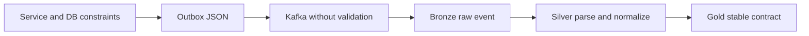
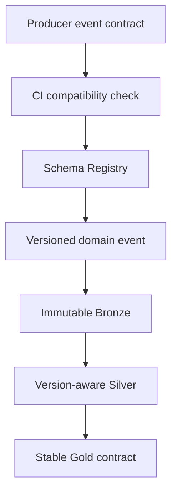

# Schema evolution

## What the demo implements today

This demo uses an **unmanaged hybrid** approach that leans toward schema-on-read. It does not currently run a Schema Registry, so Kafka does not validate event payloads or enforce compatibility.

The word _schema_ refers to several different contracts in this platform:

| Boundary | Current approach | Enforcement |
|---|---|---|
| Service request and domain model | Schema-on-write | Java types, Bean Validation, database constraints |
| Transactional outbox row | Schema-on-write | PostgreSQL table definition |
| Domain event JSON payload | Producer convention | Application code only; no registry |
| Kafka domain topic | Schemaless transport | Event type is carried in a Kafka header |
| Bronze tables | Schema-on-read | Raw payload and CDC metadata are retained |
| Silver models | Schema-on-read and normalization | SQL casts, deduplication and dbt tests |
| Gold models | Curated schema-on-write-like contract | Explicit dbt columns, tests and semantic catalog |

The effective flow is:



This is hybrid because producers and PostgreSQL impose a write schema, while the analytics platform interprets and normalizes the event payload when it is read. It is _unmanaged_ because nothing at the Kafka boundary prevents an incompatible producer change.

## Topic-per-domain implications

The platform uses one Kafka topic per domain rather than one topic per event type. For example, both `InvoiceIssued` and `InvoiceAdjusted` are routed to `outbox.event.invoice`. The `eventType` header identifies which payload contract applies.

Consequently, compatibility must be evaluated per `(domain topic, eventType)`, not by assuming every record in a topic has the same payload. A consumer should dispatch on `eventType`, parse only the corresponding contract, and send unknown or invalid event types to a dead-letter path instead of silently accepting corrupt data.

The topic is the domain's transport boundary; it is not itself the schema version. Adding a new event type normally does not require a new topic.

## Evolution rules for the current demo

Safe changes are additive and preserve the meaning and type of existing fields:

- Add an optional field.
- Add a field with a documented default.
- Add a new event type to an existing domain topic.
- Add a nullable column in Silver and expose it in Gold only after consumers are ready.

Risky or breaking changes include:

- Rename or remove a field.
- Change a field's type, unit, currency semantics, timezone or identifier meaning.
- Make an optional field required.
- Reuse an event type name for a different business event.
- Change a key or partitioning rule without planning state migration and ordering effects.

For example, adding `salesChannel` to `InvoiceIssued` is safe if it is optional:

```json
{
  "invoiceId": "8abf...",
  "amount": 100.00,
  "currency": "EUR",
  "salesChannel": "WEB"
}
```

Historical Bronze records do not contain the field. Silver can initially project it as nullable, and Gold can expose it after downstream reports have been tested. Renaming `amount` to `grossAmount` directly would not be safe: old and new events would require different parsing logic and existing consumers would break.

## Recommended production approach

A production version should use a governed hybrid model:

1. Define a machine-readable contract for every event type.
2. Validate producer changes in CI.
3. Enforce compatibility through a Schema Registry at the Kafka boundary.
4. Keep the original, immutable event representation in Bronze.
5. Normalize multiple compatible versions in Silver.
6. Publish stable, tested Gold and semantic-layer contracts.

Avro with Apicurio Registry or Confluent Schema Registry is a natural fit for Debezium. Protobuf is also suitable when strongly typed cross-language application contracts are the priority. JSON Schema is more human-readable but typically produces larger messages.

Use `BACKWARD_TRANSITIVE` compatibility by default. A new consumer schema must be able to read data written with every previous registered version, not only the immediately preceding version. This works well with Kafka retention and replay.



### Subject naming with topic-per-domain

The default `<topic>-value` subject strategy is a poor match when several independently evolving event types share one domain topic: it can force unrelated record types into one compatibility chain. Prefer a record-based strategy, or an equivalent registry convention, so that `InvoiceIssued` and `InvoiceAdjusted` have independent schema histories while remaining on `outbox.event.invoice`.

The exact strategy depends on the selected serializer and registry, but the invariant is the same: each event type has an identifiable contract and compatibility history.

## Versioning policy

Do not add `v2` to every event or topic for an additive change. Schema Registry versions already represent compatible structural evolution.

Create a new event type, such as `InvoiceIssuedV2`, only when the business meaning or structure cannot be evolved compatibly. During migration:

1. Publish the old and new representations for a bounded period, or provide an explicit upcaster.
2. Update Bronze/Silver processing to understand both versions.
3. Migrate and observe all consumers.
4. Stop the old representation only after consumer ownership and replay requirements are verified.

A separate topic is justified when operational properties change—not merely the payload version—for example different retention, security ACLs, throughput, ordering boundaries or ownership.

## dbt responsibilities

Schema Registry protects the transport contract, but it does not replace dbt tests. The layers protect different concerns:

| Control | Detects |
|---|---|
| Registry compatibility | Structurally incompatible event changes |
| Bronze ingestion checks | Unparseable records, unknown event types, missing ingestion metadata |
| Silver dbt tests | Invalid casts, uniqueness, referential integrity, accepted values |
| Gold dbt contracts/tests | Breaking analytical columns and business invariants |
| Semantic API catalog | Unsupported measures, dimensions, joins and query shapes |

Silver should explicitly handle every supported event version and preserve enough metadata—event type, schema identifier/version, event id, source timestamp and ingestion timestamp—to diagnose or replay transformations.

## CI/CD evolution sequence

A production pull request that changes an event should:

1. Update the event contract and compatibility fixtures.
2. Run a registry compatibility check against all historical schemas.
3. Run producer serialization and consumer deserialization contract tests.
4. Run a replay test containing old and new events through Bronze and Silver.
5. Run dbt tests and detect breaking Gold/semantic changes.
6. Deploy consumers before producers when a change requires new consumer behavior.
7. Observe deserialization failures, unknown event types, dead-letter volume and consumer lag during rollout.

## Current limitation and next exercise

The demo intentionally stops before registry-backed enforcement. Its JSON contracts are implicit, so additive evolution can be demonstrated but incompatible changes are not automatically rejected.

A useful extension exercise is to add a registry and demonstrate two pull requests:

- An optional `salesChannel` field on `InvoiceIssued` that passes compatibility checks and remains `NULL` for historical events.
- A change from `amount` decimal to string that CI rejects before deployment.

That exercise makes the distinction between transport compatibility, raw-data preservation and analytical-contract stability visible end to end.
